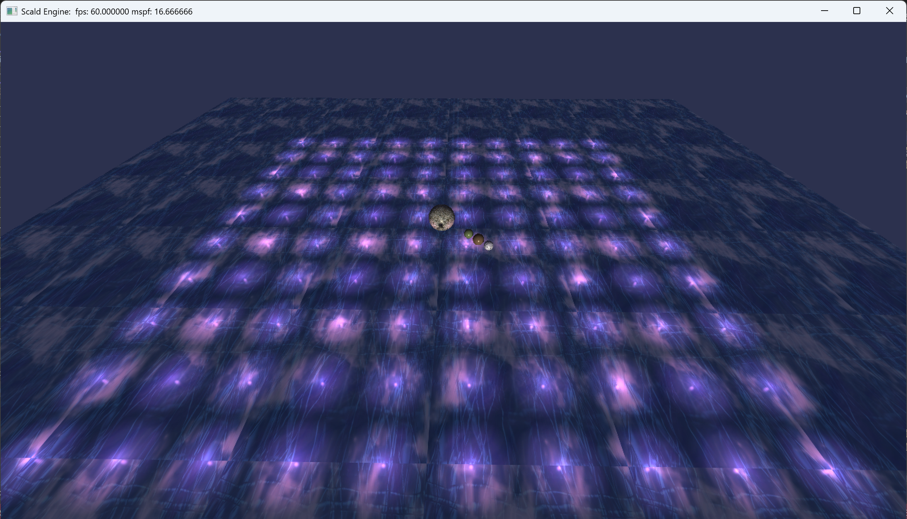

# Scald Engine DirectX 12

# Screenshots

 

 

 

 

# Features

## Graphics

- Deferred Rendering
  - GBuffer
    - Diffuse Albedo
    - Ambient Occlusion (work in progress)
    - Normal
    - Specular (FresnelR0 + Roughness)
    - Motion Vectors (work in progress)
    - Depth
- Lighting & Shadows
  - Directional Lights
    - Cascaded Shadows
    - PCF
  - Point Lights (Instancing)
- Textures
  - Bindless
  - SkySphere 